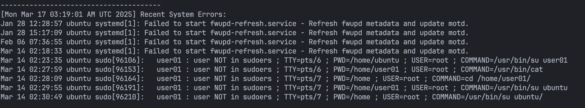
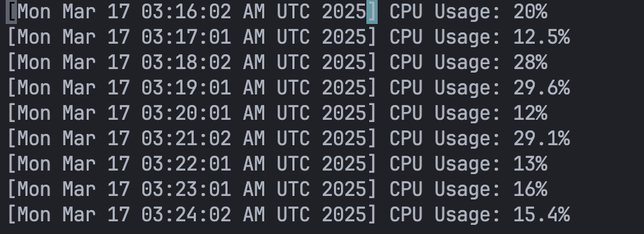

#  💻 Server-Monitoring
> **리눅스에서 안정된 서버를 유지하기 위한 모니터링**
<br></br>

## 👨‍👨‍👦‍👦 Team

👥 팀명 : 커닝시티

|||||
|:-:|:-:|:-:|:-:|
|HanJH<br/>[@letsgojh0810](https://github.com/letsgojh0810)|태규<br/>[@EOTAEGYU](https://github.com/EOTAEGYU)|nahong_c<br/>[@HongChan1412](https://github.com/HongChan1412)|Jihoon Kim<br/>[@wild-turkey](https://github.com/wild-turkey)|


</br>

## 🎯 프로젝트 목표

#### 1. 서버 가용성 및 부하 기록 시스템
#### 2. 사용자 로그인 기록 분석 시스템
#### 3. 시스템 오류 및 서비스 장애 감지 시스템
#### 4. 디스크 사용량 모니터링 및 알림 시스템
#### 5. 네트워크 연결 상태 모니터링
#### 6. CPU 사용량 및 프로세스 자동 정리 시스템

</br>


# 🚀 Ubuntu에서 크론탭을 이용한 서버 모니터링 자동화

이 문서는 **Ubuntu에서 크론탭을 이용해 CPU, 디스크, 네트워크 상태, 서버 가용성, 시스템 오류, 사용자 로그인을 자동으로 모니터링하는 방법**을 정리한 것입니다.

---

## 📌 1. 설정할 크론탭 스크립트 목록

아래 6개의 쉘 스크립트를 실행하여 시스템 상태를 모니터링합니다.

| 스크립트 | 설명 |
|----------|------------------------------------------------|
| `cpu_monitor.sh` | CPU 사용량 확인 및 과부하 프로세스 종료 |
| `disk_monitor.sh` | 디스크 사용량 모니터링 및 경고 발송 |
| `network_monitor.sh` | 네트워크 연결 상태 확인 |
| `server_availability.sh` | 서버 가용성 및 부하 기록 |
| `system_errors.sh` | 시스템 오류 및 장애 감지 |
| `user_logins.sh` | 사용자 로그인 기록 분석 |

---


---


# 🚀 Ubuntu에서 크론탭을 이용한 서버 모니터링 자동화

이 문서는 **Ubuntu에서 크론탭을 이용해 CPU, 디스크, 네트워크 상태, 서버 가용성, 시스템 오류, 사용자 로그인을 자동으로 모니터링하는 방법**을 정리한 것입니다.

---

## 📌 1. 설정할 크론탭 스크립트 목록

아래 6개의 쉘 스크립트를 실행하여 시스템 상태를 모니터링합니다.

| 스크립트 | 설명 |
|----------|------------------------------------------------|
| `cpu_monitor.sh` | CPU 사용량 확인 및 과부하 프로세스 종료 |
| `disk_monitor.sh` | 디스크 사용량 모니터링 및 경고 발송 |
| `network_monitor.sh` | 네트워크 연결 상태 확인 |
| `server_availability.sh` | 서버 가용성 및 부하 기록 |
| `system_errors.sh` | 시스템 오류 및 장애 감지 |
| `user_logins.sh` | 사용자 로그인 기록 분석 |

---

## 📌 2. 쉘 스크립트 생성

모든 스크립트는 `/home/ubuntu/mission/` 폴더에 위치해야 합니다.

### `cpu_monitor.sh` (CPU 사용량 확인)
```bash
#!/bin/bash

THRESHOLD=90
LOG_FILE="/var/log/cpu_monitor_cron.log"

export PATH=/usr/local/sbin:/usr/local/bin:/usr/sbin:/usr/bin:/sbin:/bin

CPU_USAGE=$(top -bn1 | grep "Cpu(s)" | awk '{print $2 + $4}')

echo "[$(date)] CPU Usage: $CPU_USAGE%" >> $LOG_FILE

if (( $(echo "$CPU_USAGE > $THRESHOLD" | bc -l) )); then
    HIGH_CPU_PROCESS=$(ps -eo pid,comm,%cpu --sort=-%cpu | awk 'NR==2 {print $1}')
    echo "[$(date)] Killing high CPU process: $HIGH_CPU_PROCESS" >> $LOG_FILE
    kill -9 $HIGH_CPU_PROCESS
fi
```
### `disk_monitor.sh` (디스크 사용량 모니터링)
```bash
#!/bin/bash

THRESHOLD=90
LOG_FILE="/var/log/disk_monitor_cron.log"

USAGE=$(df -h / | awk 'NR==2 {print $5}' | sed 's/%//')

echo "[$(date)] Disk Usage: $USAGE%" >> $LOG_FILE

if [ "$USAGE" -ge "$THRESHOLD" ]; then
    echo "Warning! Disk usage is at $USAGE%" >> $LOG_FILE
fi
```

### `network_monitor.sh` (네트워크 상태 확인)
```bash
#!/bin/bash

LOG_FILE="/var/log/network_monitor_cron.log"
TARGET="8.8.8.8"

if ping -c 1 $TARGET &> /dev/null; then
    echo "[$(date)] Network is UP" >> $LOG_FILE
else
    echo "[$(date)] Network is DOWN" >> $LOG_FILE
fi
```

### `server_availability.sh` (서버 가용성 모니터링)
```bash
#!/bin/bash

LOG_FILE="/var/log/server_availability_cron.log"

echo "[$(date)] CPU Load: $(uptime | awk -F'load average: ' '{print $2}'), RAM Usage: $(free -h | awk '/Mem/ {print $3 "/" $2}')" >> $LOG_FILE
```

### `system_errors.sh` (시스템 오류 감지)
```bash
#!/bin/bash

LOG_FILE="/var/log/system_errors_cron.log"

echo "[$(date)] Recent System Errors:" >> $LOG_FILE
journalctl -p 3 -n 10 >> $LOG_FILE
echo "---------------------------------------" >> $LOG_FILE
```

### `user_logins.sh` (사용자 로그인 기록 분석)
```bash
#!/bin/bash

LOG_FILE="/var/log/user_logins_cron.log"

echo "[$(date)] Recent Logins:" >> $LOG_FILE
last -n 10 >> $LOG_FILE
echo "---------------------------------------" >> $LOG_FILE
```

---

## 📌 3. 실행 권한 부여

```bash
chmod +x /home/ubuntu/mission/*.sh
```

---

## 📌 4. 크론탭 설정

크론탭을 열어서 스크립트를 주기적으로 실행하도록 설정합니다.

```bash
crontab -e
```

### 크론탭 설정 (5분마다 실행)
```bash
*/5 * * * * /bin/bash /home/ubuntu/mission/cpu_monitor.sh >> /var/log/cpu_monitor_cron.log 2>&1
*/5 * * * * /bin/bash /home/ubuntu/mission/disk_monitor.sh >> /var/log/disk_monitor_cron.log 2>&1
*/5 * * * * /bin/bash /home/ubuntu/mission/network_monitor.sh >> /var/log/network_monitor_cron.log 2>&1
*/5 * * * * /bin/bash /home/ubuntu/mission/server_availability.sh >> /var/log/server_availability_cron.log 2>&1
*/5 * * * * /bin/bash /home/ubuntu/mission/system_errors.sh >> /var/log/system_errors_cron.log 2>&1
*/5 * * * * /bin/bash /home/ubuntu/mission/user_logins.sh >> /var/log/user_logins_cron.log 2>&1
```

✅ 실행 간격을 조정하고 싶다면 `*/10 * * * *` (10분마다), `0 * * * *` (매시간) 등의 값을 변경하면 됩니다.

---

## 📌 5. 크론 실행 여부 확인

```bash
tail -f /var/log/syslog | grep CRON
```

✅ **크론탭이 정상적으로 실행되는지 확인!**

---

## 📌 6. 실행 로그 확인

```bash
tail -f /var/log/cpu_monitor_cron.log
tail -f /var/log/disk_monitor_cron.log
tail -f /var/log/network_monitor_cron.log
tail -f /var/log/server_availability_cron.log
tail -f /var/log/system_errors_cron.log
tail -f /var/log/user_logins_cron.log
```

✅ **각 스크립트가 로그를 정상적으로 저장하고 있는지 확인!**

---

## 📌 7. 실행 결과
- system_errors.log  
  

- cpu_usage.log  
  


---

## 📌 8. 최종 정리

- `/home/ubuntu/mission`에 쉘 스크립트 저장
- `chmod +x /home/ubuntu/mission/*.sh` 실행하여 실행 권한 부여
- `crontab -e`에서 크론탭 등록
- 로그 저장 확인: `tail -f /var/log/*.log`
- 크론 실행 여부 확인: `tail -f /var/log/syslog | grep CRON`
- `No MTA installed` 해결: 로그 파일 저장 or `postfix` 설치